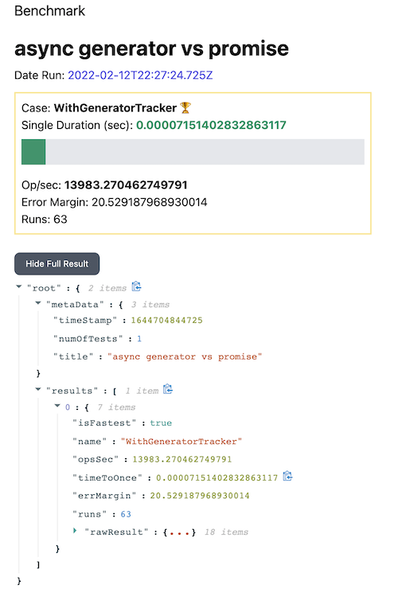

# Benchmark Runner & Result Viewer

## Runner
Use [BenchmarkJS](https://benchmarkjs.com/) to run performance tests locally on Node.

## Viewer
After running the test successfully, you can use the viewer to see test performance details in your browser.



---

### How to organize your test suites:

- Create test files in `/suites` directory
  - See `setups.js` and `processor.test.js` for examples.

- MUST name your test files with `.test.` in the name. The runner will process any file matching the convention.

### Quick Start

```
yarn install-runner // to install runner-only
yarn install-viewer // to install results viewer
```

### Execute Test Suites
```
yarn run-test
```

### View test results in browser

```
yarn show-result
```